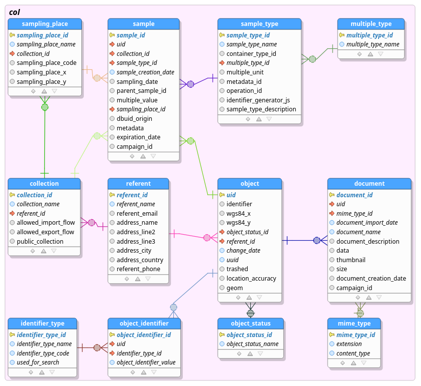

# Usage example

This example has been created to work with Collec-Science database ([https://github.com/Irstea/collec]).

**Warning**: this example must not be used to transfer data between two Collec-Science databases: some data are missing or are not correctly formatted to respect the internal structure of this application.

## Examples of scripts

These scripts are used to export all samples of a collection from a Collec-Science database.

### Generate the structure of the database corresponding to the export description

~~~
php dbexportmodel.php --descriptionname=example/dbexportdescription.json --structurename=example/dbexportstructure.json --structure
~~~

*example/dbexportstructure.json* contains the description of the tables implicated in the description of the export.

### Generate the sql code to create the tables involved by the export

~~~
php dbexportmodel.php --descriptionname=example/dbexportdescription.json --structurename=example/dbexportstructure.json --sqlfile=example/dbcreate.sql --create
~~~

The file *example/dbcreate.sql* can be used to create the tables in another database.

### Export the data for the collection #2

Create a file *example/dbexportkeys.json*:

~~~
[2]
~~~

2 is the key of a collection. If another value should have been indicated, the structure of the file would have been:

~~~
[2,5]
~~~

Generate the export with:

~~~
php dbexportmodel.php --descriptionname=example/dbexportdescription.json --structurename=example/dbexportstructure.json --keyfile=example/dbexportkeys.json --dataname=example/dbexportdata.json --binaryfolder=example/binary --export
~~~

The data are in the file *example/dbexportdata.json*, and the binary files, if exists, in the folder *example/binary*.

### Create the database

With the script example/dbcreate.sql, you can create the tables in your database. The corresponding structure is:

To import data:

~~~
php dbexportmodel.php --descriptionname=example/dbexportdescription.json --structurename=example/dbexportstructure.json --keyfile=example/dbexportkeys.json --dataname=example/dbexportdata.json --binaryfolder=example/binary --import
~~~

Nota: the file *example/dbexportdata.json* is not provided in this example. Others files are available.

## Using a zip file

You can use a zip file to exchange data.

The first stages are the same. To export data:

~~~
php dbexportmodel.php --descriptionname=example/dbexportdescription.json --structurename=example/dbexportstructure.json --keyfile=example/dbexportkeys.json --zipfile=example/data.zip --export --zip
~~~

The file *example/data.zip* contains:

* **dbexportdescription.json**: file containing the business description of the export
*  **dbexportstructure.json**: file containing the database structure (description of the tables and the relations between them)
*  **dbexportdata.json**: file containing the exported data
*  **binary**: folder containing the generated binary files, if occurred

To import data:

~~~
php dbexportmodel.php --zipfile=example/data.zip --import --zip
~~~

The program use the folder *tmp* to unzip the file.